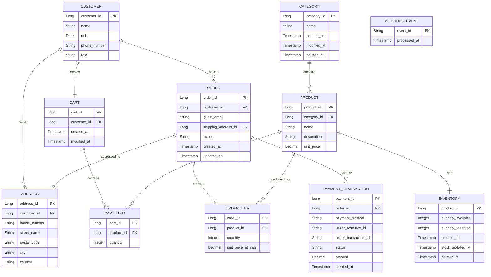
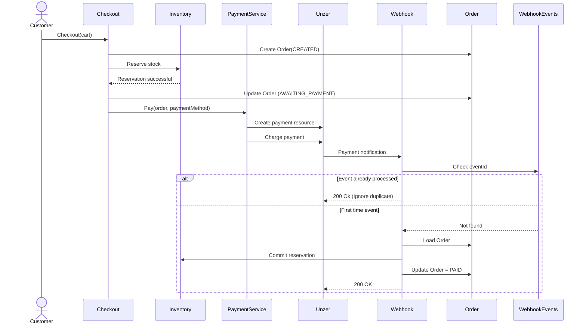

# System Architecture

## 1. Overview and Assumptions
This document architects the backend for a full-fledged e-commerce shop focusing on the checkout and payment lifecycle integrating with consistency and failure handlings. The system integrates Unzer as the external payment provider.

The assumptions made for this design are as follows.

* Customer registration is not mandatory and Guest checkout is possible.
* A single currency and single region are assumed for the initial version.
* Card data is never exposed to the system's backend in raw form. The tokenized version is obtained from Unzer's UI components and this is sent to the sever.


## 2. System Decomposition
For the initial design of the system, modular monolith is chosen since the initial product scope does not require independent deplooyment of every component which makes it simpler and consistency handling is rather easier in such architecture due to easier communication between modules. However, when the services expand and calls for a more larger scale, each module could be extracted as a microservice.

Within the monolith, the code is organized into cohesive packages by domain rather than by technical layer: user accounts, catalog, cart, inventory, order, payment, webhook. Each package exposes a service interface to the others and owns its own repositories. Intermodule calls are possible through Java method calls.

## 2. Domain and Data Model
The main domains identified for the system are Accounts, Catalog, Cart, Inventory, Order and Payment.


| Entity | Owned By | Description |
| ------------- | ------------- | -----------|
| Customer      | Accounts     | Registered accounts with customer details (hashed passwords). Role : ADMIN or CUSTOMER (default) |
| Address | Accounts | Registered addresses of customers. |
| Product      | Catalog     | Products and details including variants, unit price and curreny. Belongs to one of the catgeories in the Category entity. |
| Category      | Catalog     | Product category and details.|
| Inventory | Inventory | Product inventory that supports update and tracking of available stock and reservations.|
| Cart | Cart | User's cart, prepurchase intent.|
| Cart Item | Cart | Details of the user's cart, including items and selected quantities.|
| Order | Order | Immutable snapshot to identify the order created once checkout processed, including payment method selected and totals.|
| Order Item | Order | Details on the items in the order and quantity, including their prices during purchase.|
| Payment Transaction| Payment | Tracking payments initiated, completed and failed. |
| Processed Webhook Event | Payment | Tracking Unzer's payment webhook events for idempotency.|

A user with shop-admin role is able to perform CRUD operations on the entities owned by the Catalog domain. Regular customers are restricted to their own carts, orders and addresses.



## 3. Inventory Management and Oversell Prevention

The main concurrency challenge is preventing overselling. Multiple customers can send a purchase request for the last available item. In order to prevent overselling, a reservation operation is performed via an atomic database update.

Reserve inventory 
```
    UPDATE inventory 
    SET reserved_quantity = reserved_quantity + cart_qty, last_updated = NOW() 
    WHERE product_id = item_id AND available_quantity - reserved_quantity >= cart_qty;
```
Release reservation 
```
    UPDATE inventory 
    SET reserved_quantity = reserved_quantity - cart_qty, last_updated = NOW() 
    WHERE product_id = item_id AND reserved_quantity >= cart_qty;
```
Commit reservation 
```
    UPDATE inventory 
    SET available_quantity = available_quantity - cart_qty, reserved_quantity = reserved_quantity - cart_qty, last_updated = NOW() 
    WHERE product_id = item_id
```

In case of cancelled checkout, the reservation time exceeding a limit or the payment failing, the reservation is released. If the checkout and payment processes succeed then the reservation is commited and the inventory's available quantity is updated.

## 4. Checkout and Payment Flow

A customer (registered and logged in or guest user) adds items to the cart and proceeds to checkout. If the reservation process succeeds i.e, the items and selected quantity are available, the user can proceed to selecting the payment method and providing further checkout details. An Order is created and for each order, the general order status follows the lifecycle:  
CREATE -> AWAITING_PAYMENT -> PAID -> FULILLING -> SHIPPED -> COMPLETED.

Once the order is initiated successfully and until payment process is completed, the order status is at AWAITING_PAYMENT. The Unzer payment subsystem is integrated into the payment flow. Once the user selects the payment method and provides the necessary details, the respective Unzer payment method is invoked and Unzer handles the payment authorization and charging. 

The payment subsystem is isolated behind an internal payment abstraction so that the checkout and order modules do not depend directly on the Unzer SDK. Instead of invoking SDK-specific classes, the checkout flow delegates payment processing to a common payment interface, while each supported payment method provides its own implementation. Each payment handler is responsible for creating the appropriate Unzer payment resource, initiating the required transaction (such as authorize or charge) and transforming the responses into the standard Payment Transaction record. 

This abstraction of payment process allows for adding further payment methods while preserving the checkout flow.
The Unzer resource identifiers and transaction identifiers returned by the SDK are persisted in the Payment Transaction records. These identifiers are later used to correlate incoming webhook events with the corresponding order and payment records.

To handle payment failures due to network drops or timeouts the webhook events are processed instead of redirecting to a URL. The webhook events are tracked and their notifications are treated as authoritative source of payment state. Once the webhook event is successful, the corresponding order is updated and inventory reservation is committed. This way of handling webhook events also prevent charging multiple times. If the same event is triggered, possibly due to resubmitting a payment, only the first one is processed.  

When a payment is completed successfully, the order status is updated to PAID and the reservation is commited. If any errors in payment, it is PAYMENT_FAILED and the inventory reservation is released.



## 5. Technology Choices

| Concern | Choice | Reasons |
| ------- | ------ | ------- |
| Language/Framework | Java 17, Spring Boot | Java supports multithreading and concurrency and also suitable for scalable applications. Spring Boot makes development, testing and deployment simpler and more convenient with minimizing configurations. |
| Payment Integration | Unzer Java SDK | Officially recommended and supported. Provides a vast options of payment methods to select from. Handles authorization and charging. |
| Database | PostgreSQL | PostgreSQL is a reliable and ACID compliant database.| 

## 6. Deployment and DevOps

The Spring boot application is containerized and orchestrated with Amazon ECS with Fargate. AWS CloudWatch logs and tracks the performance of the application, and an Elastic Load Balancer is implemented to distribute traffic across running instances and ensure smooth operation during peak access hours.

Amazon RDS PostgreSQL is used as the database for the system. The Unzer private key and other secrets are stored in AWS Secrets Manager and injected into the running containers as environment variables at deploy time, so they are never committed to source control or built into the container image.

Code changes go through a CI/CD pipeline that runs the test suite — including the inventory concurrency and webhook idempotency tests — as a merge gate, before building and pushing a new container image to ECS. This ensures the two consistency properties the design leans on most heavily are re-verified automatically on every change.

## 7. Security and Compliance
To reduce PCI-DSS scope, raw card information never reaches the backend. Card details are collected through Unzer UI Components and exchanged for a payment resource/token. The backend only handles references and payment identifiers. 

User authentication and authorization are enforced using role-access control. Users can login with hashed passwords and only users with "Shop admin" role are given access to CRUD operations on the Catalog. Guest users are not required to authenticate.

Sensitive configuration data are never stored in source control. Secrets are managed via dedicated secrets management system such as AWS Secrets Manager.

In order to comply with the applicable commercial law, order and payment transaction records are retained for the required period. After the retention period personal fields are anonymized. 

## 8. Trade-offs and Next Steps
A modular monolith is chosen initially to keep the system less complex and to make consistency easier to reason about and enforce, since this architecture enables faster development than coordinating consistency across separate services. As the system scales further, individual modules could be extracted into microservices, with AWS Lambda introduced to handle asynchronous and event-triggered processes — such as the reservation-expiry sweep for abandoned, unpaid orders — rather than everything running inline within the monolith.

Currently, the payment storing isn't considered into the design, which is a common e-commerce convenience feature. Every purchase re-tokenizes a card rather than reusing a saved one. In the next steps, this feature could be incorporated for a smoother payment process.

The current implementation assumes that inventory reservation succeeds before the checkout proceeds to payment. In a production system, reservation failure would be handled explicitly. If sufficient stock is no longer available (for example, another customer purchases the last remaining item), the reservation attempt fails atomically and the customer is redirected back to the cart or checkout page with an "Out of stock" message. No payment is initiated, and the user is given the opportunity to update the cart before retrying checkout.